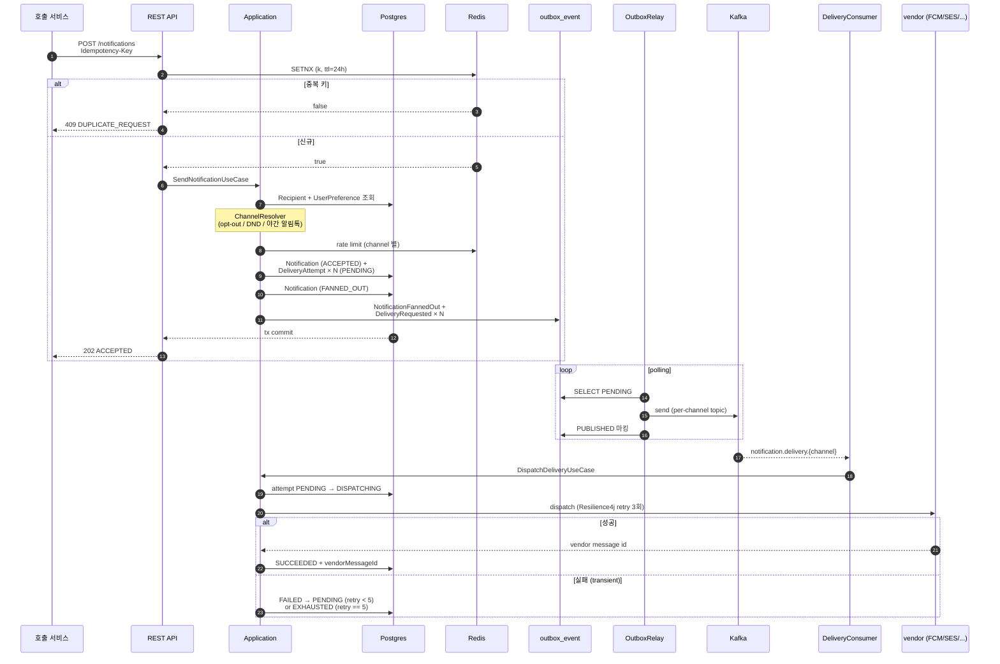
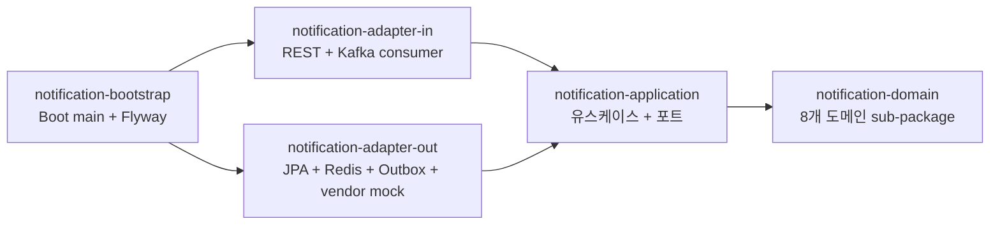
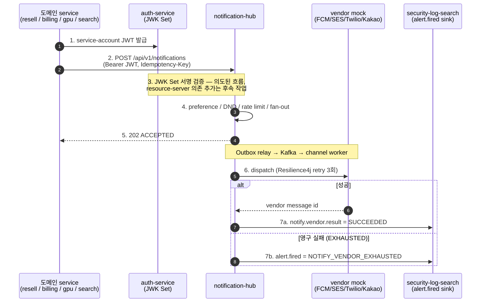

# Notification Hub

[](https://github.com/ssa1004/notification-hub/actions/workflows/ci.yml)
[](https://codecov.io/gh/ssa1004/notification-hub)
[](https://kotlinlang.org/)
[](https://openjdk.org/projects/jdk/21/)
[](https://spring.io/projects/spring-boot)
[](https://gradle.org/)
[](LICENSE)

> **English summary** — Korean docs follow below.

## Overview (EN)

**Notification Hub** is a multi-channel notification dispatch service. A single notify request is
fanned out — per the recipient's channel preferences and the sender's policy — across **push /
email / SMS / KakaoTalk AlimTalk**, bundling **idempotency, retry, DLQ, rate limiting, templating,
Do-Not-Disturb (quiet hours), opt-out, and delivery tracking** into one flow.

```
1 request ──▶ fan-out to N channels ──▶ per-channel worker ──▶ vendor call
               (Outbox + Kafka)          (Resilience4j retry)   (FCM / SES / Twilio / Kakao)
```

**Stack** — Kotlin 1.9 on JDK 21 (virtual threads) · Spring Boot 3.5 · PostgreSQL 16 / H2 ·
Redis (Lettuce) · Apache Kafka (per-channel topics, Outbox pattern) · Resilience4j · Mustache ·
Gradle 8 · Docker / Kubernetes (Helm) · Testcontainers.

**Architecture** — hexagonal, 6 Gradle modules: `domain → application ← adapter-in / adapter-out`,
wired by `bootstrap` (see the [module diagram](docs/diagrams/module-structure.svg) and
[delivery-flow diagram](docs/diagrams/delivery-flow.svg)). 15 ADRs in [docs/adr/](docs/adr/) record
the key decisions; [docs/backend-skills-index.md](docs/backend-skills-index.md) maps each pattern to
its code location, ADR, and theory.

**Language status (honest)** — **production code is 100% Kotlin** (no `.java` under any `src/main`).
The **test suite is mixed and migration is in progress**: the `bootstrap` context tests and the
Testcontainers `e2e-tests` are already Kotlin, while the **domain / application / adapter unit tests
(22 files) are still JUnit 5 in Java**. They run unchanged on the JVM and gate CI; porting them to
Kotlin is tracked under [향후 개선 사항](#향후-개선-사항). The badges above pin Kotlin/JDK/Spring
versions, not test-suite language.

**Run it** — `make run` boots the app on `:8080` with H2 + mock vendors and **zero external
dependencies**. See [실행 방법](#실행-방법) for the prod profile (Postgres / Redis / Kafka) and the
curl walkthrough.

---

다채널 알림 발송 hub 입니다. 한 알림 요청을 사용자의 채널 선호도와 발송자 정책에 따라
push / email / SMS / 카카오 알림톡 등으로 fan-out 하고, retry / DLQ / rate limit / template /
방해금지 시간 (DND, Do Not Disturb) / opt-out / 전송 추적까지 묶음 처리합니다.

```
요청 1건 ──▶ 채널 N개 fan-out ──▶ 채널별 worker ──▶ vendor 호출
              (Outbox + Kafka)        (Resilience4j retry)   (FCM / SES / Twilio / Kakao)
```

## 기술 스택

- **Language**: Kotlin 1.9 (JDK 21 toolchain, virtual threads)
- **Framework**: Spring Boot 3.5
- **Database**: PostgreSQL 16, H2 (local/dev)
- **Cache / KV**: Redis (Lettuce)
- **Messaging**: Apache Kafka (channel 별 topic 분리, Outbox 패턴)
- **Resilience**: Resilience4j (vendor 호출 retry)
- **Template**: Mustache (단일 중괄호 placeholder)
- **Build / CI**: Gradle 8, GitHub Actions, Docker, Kubernetes
- **Test**: Testcontainers (Postgres + Kafka + Redis)

## 풀어야 할 핵심 문제

- **알림 중복 발송 방지** — 사용자가 결제 후 두 번 클릭하거나 cron 이 재시작되어도 같은
  알림은 1번만. `Idempotency-Key` 헤더 + Redis SETNX (`SET IF NOT EXISTS`, 키가 없을 때만
  set 하는 원자 연산) + TTL 24h. 같은 키 재요청은 HTTP 409.
- **DB 커밋 ↔ 이벤트 발행 원자성** — "발송 등록" 트랜잭션 commit 과 Kafka publish 가 따로
  처리되면 안 됨. Outbox 패턴 (이벤트를 일단 같은 트랜잭션 안에서 outbox 테이블에 INSERT
  하고 별도 워커가 그걸 읽어 Kafka 로 보내는 구조) 으로 해결.
- **채널별 처리량 격리** — SMS / 알림톡은 vendor 호출당 비용 / throughput 한도가 PUSH /
  EMAIL 과 매우 다름. 같은 Kafka topic 에 섞으면 head-of-line blocking(= 한 줄로 세우면 맨 앞의 느린 문자/알림톡 하나가 뒤의 빠른 푸시까지 다 막는 현상 — 계산대 맨 앞 손님이 막히면 뒷줄 전체가 멈춤). 채널별로 topic /
  consumer-group / DLQ 정책 분리.
- **vendor 일시 장애 흡수** — FCM 5xx, SES throttling, 알림톡 timeout. Resilience4j
  `@Retry` (3회) + 도메인 단의 exponential backoff (max 5회) = 최대 8회 재시도 기회.
  그래도 실패하면 EXHAUSTED → 운영자 수동 재처리.
- **사용자 폭주 알림 차단** — 잘못된 cron 한 번이 같은 사용자에게 만 건 발송하면 vendor 비용
  폭증 + 스팸 신고. recipient × channel 별 token bucket (Redis INCR + PEXPIRE 를 Lua 로
  원자 처리) — 한도 초과 시 HTTP 429 + Retry-After.
- **방해금지 시간 / opt-out** — 마케팅 알림 야간 발송은 앱 삭제 1순위 사유. 사용자 timezone
  기반 22:00~08:00 silent (보안 알림 SECURITY 만 우회). 카카오 알림톡 은 vendor 정책상
  야간 무조건 차단.
- **다국어 / 채널별 본문 분리** — `auth.otp.v1` 한 키가 ko-kr / en-us locale 별, 그리고
  PUSH (긴 본문 가능) / SMS (90B 한도) 별 다른 row. 우선 locale → 없으면 ko-kr fallback.
- **이력 페이지네이션** — 사용자 알림 누적이 많으므로 offset 페이지네이션은 deep page 가
  느림. 직전 페이지 마지막 row 의 id 를 cursor 로 받는 방식.

## 핵심 설계 결정

상세한 배경은 [docs/adr/](docs/adr/) 의 15건에 있습니다. 백엔드 패턴을 **공부 목적**으로
본다면 → [docs/backend-skills-index.md](docs/backend-skills-index.md): 이 레포가 시연하는
패턴을 "코드 위치 → 왜(ADR) → 이론([dev-lab](https://github.com/ssa1004/dev-lab))" 으로 잇는
학습 인덱스.

| ADR | 결정 |
|---|---|
| [0001](docs/adr/0001-hexagonal-architecture.md) | 헥사고날 + 6개 멀티모듈(= 핵심 로직을 한가운데 두고 DB·Kafka·웹은 콘센트·플러그처럼 갈아끼우게 분리한 구조를, 역할별 6개 Gradle 모듈로 나눈 것) |
| [0002](docs/adr/0002-channel-fanout-topics.md) | 다채널 fan-out 을 Kafka topic 분리로 |
| [0003](docs/adr/0003-template-engine-mustache.md) | 템플릿 엔진 Mustache (Thymeleaf / Freemarker 비교) |
| [0004](docs/adr/0004-idempotency-outbox-retry.md) | Idempotency-Key + Outbox + retry 의 3중 안전망 |
| [0005](docs/adr/0005-user-preference-priority.md) | 종류별 opt-out / DND / 채널 우선순위 |
| [0006](docs/adr/0006-rate-limit-token-bucket.md) | 채널별 차등 한도 token bucket |
| [0007](docs/adr/0007-vendor-adapter-port.md) | DeliveryGateway 공통 port 1개 + 채널별 adapter |
| [0008](docs/adr/0008-hikaricp-tuning.md) | HikariCP 명시 튜닝 + leak detection |
| [0009](docs/adr/0009-k8s-probes.md) | K8s 3종 probe (startup / readiness / liveness) 분리 |
| [0010](docs/adr/0010-graceful-shutdown.md) | Graceful shutdown — Spring + K8s preStop 연계 |
| [0011](docs/adr/0011-resilience4j-retry-tuning.md) | Resilience4j retry — exp backoff + jitter, vendor 별 분리 |
| [0012](docs/adr/0012-dlq-admin-endpoint.md) | DLQ 운영 endpoint — list / replay / discard |
| [0013](docs/adr/0013-multi-device-push-fanout.md) | Multi-device push fan-out + 영구 실패 자동 비활성화 |
| [0014](docs/adr/0014-hmac-webhook-callback-verification.md) | HMAC-SHA256 webhook 콜백 서명 검증 |
| [0015](docs/adr/0015-dlq-admin-api-v2.md) | DLQ 운영 API 확장 — filter / detail / stats / bulk |

## 발송 흐름



> Mermaid 를 지원하지 않는 뷰어용 정적 사본: [docs/diagrams/delivery-flow.svg](docs/diagrams/delivery-flow.svg)

## 모듈 구조



> Mermaid 를 지원하지 않는 뷰어용 정적 사본: [docs/diagrams/module-structure.svg](docs/diagrams/module-structure.svg)

도메인 sub-package:

| Package | 책임 |
|---|---|
| `notification` | Notification (aggregate root), Kind, Status, fanned-out event |
| `delivery` | DeliveryAttempt 상태머신, retry/backoff, DeliveryRequested event |
| `channel` | Channel + ChannelType (PUSH/EMAIL/SMS/KAKAO_ALIMTALK) + 형식 검증 |
| `recipient` | Recipient, RecipientId |
| `preference` | UserPreference (종류별 opt-out / 우선 채널) + QuietHours |
| `template` | Template (key + locale + channel 별 본문) + TemplateKey |
| `device` | DeviceToken (push 채널 raw token + disable) |
| `shared` | DomainEvent, IdempotencyKey, Locale, RateLimitDecision |

## 7개 핵심 use case

| Use case | 입력 | 핵심 책임 |
|---|---|---|
| `SendNotificationUseCase` | recipientId, kind, title/body 또는 templateKey, payload, idempotencyKey | 멱등성 점유 → preference 적용 → 채널 결정 → rate limit → DeliveryAttempt 생성 → Outbox 적재 |
| `DispatchDeliveryUseCase` | deliveryAttemptId | PENDING → DISPATCHING → vendor 호출 → SUCCEEDED / 도메인 retry 누적 |
| `AcknowledgeDeliveryUseCase` | deliveryAttemptId, success, vendorMessageId | vendor webhook 수신, idempotent (이미 final 이면 무시) |
| `UpdateUserPreferenceUseCase` | recipientId, kind, allowed, preferredChannels, quietHours, timezone | 사용자 본인 선호도 변경 (mandatory kind 는 거절) |
| `RegisterTemplateUseCase` | key, locale, channelType, title/body template | 운영자 템플릿 등록 (key+locale+channelType unique) |
| `ListMyDeliveriesUseCase` | recipientId, cursor, limit | cursor 페이지네이션 (limit max 100) |
| `RegisterDeviceTokenUseCase` | recipientId, platform, token | push device token 등록 (같은 raw token 중복 차단) |

## 실행 방법

> `make help` 로 전체 명령을 볼 수 있습니다. 가장 빠른 길:
> ```bash
> make run                       # H2 + Mock vendor 로 단독 실행 (:8080, 외부 의존 0)
> make up                        # prod 인프라 (Postgres/Redis/Kafka/Kafka-UI)
> make run-prod                  # 다른 셸에서 prod 프로파일로 앱 실행
> make demo                      # cross-repo 통합 데모 한 사이클
> ```

H2 + Mock vendor 로 외부 의존성 없이 실행할 수 있습니다.

```bash
./gradlew :notification-bootstrap:bootRun
```

prod 모드 (Postgres + Redis + Kafka) 는 docker-compose 로:

```bash
docker compose -f infrastructure/docker-compose.yml up -d postgres redis kafka kafka-ui
SPRING_PROFILES_ACTIVE=prod ./gradlew :notification-bootstrap:bootRun
```

> **Kafka listener 설계**: 호스트에서 `./gradlew :notification-bootstrap:bootRun` 으로 띄운 앱은
> `localhost:9092` 로, 컨테이너끼리는 `kafka:29092` 로 붙습니다 (compose 의 EXTERNAL/INTERNAL 두 listener).
> 단일 listener (`advertised: kafka:9092`) 면 호스트가 `kafka` 호스트명을 못 풀어 producer 가
> 무한 대기/실패합니다 — Outbox relay 가 Kafka 로 발행하지 못하는 흔한 함정.

### 발송 한 사이클 (curl)

```bash
# 1. recipient seed (실제론 외부 user/auth service 가 master)
# (본 저장소에서는 통합 테스트의 seed 코드 참조)

# 2. 알림 발송 — Idempotency-Key 필수
curl -s -X POST http://localhost:8080/api/v1/notifications \
  -H 'Content-Type: application/json' \
  -H "Idempotency-Key: $(uuidgen)" \
  -d '{
    "recipientId": "user-1",
    "kind": "SECURITY",
    "title": "OTP",
    "body": "코드: 654321"
  }' | jq

# 3. 같은 Idempotency-Key 재요청 → 409
curl -i -X POST http://localhost:8080/api/v1/notifications \
  -H 'Content-Type: application/json' \
  -H 'Idempotency-Key: dup-key-001' \
  -d '{ "recipientId":"user-1", "kind":"SECURITY", "title":"OTP", "body":"코드: 1" }'

# 4. 내 알림 이력
curl -s "http://localhost:8080/api/v1/notifications/me?recipientId=user-1&limit=10" | jq

# 5. 사용자 선호도 — 마케팅 opt-out
curl -s -X PUT http://localhost:8080/api/v1/users/user-1/preferences \
  -H 'Content-Type: application/json' \
  -d '{ "kind": "MARKETING", "allowed": false }' | jq

# 6. 운영자 템플릿 등록
curl -s -X POST http://localhost:8080/api/v1/templates \
  -H 'Content-Type: application/json' \
  -d '{
    "key": "auth.otp.v1",
    "locale": "ko-kr",
    "channelType": "SMS",
    "titleTemplate": "OTP",
    "bodyTemplate": "[Acme] OTP {code} ({validMin}분간 유효)"
  }' | jq
```

- API 문서: <http://localhost:8080/swagger>
- 메트릭: <http://localhost:8080/actuator/prometheus>
- Kafka UI: <http://localhost:8081>

## 테스트 / 빌드

```bash
./gradlew check                              # 전체
./gradlew :notification-domain:test          # 도메인 단위 (외부 의존 0)
./gradlew :notification-application:test     # use case 단위 (mock)
./gradlew :notification-adapter-out:test     # adapter 단위
./gradlew :notification-adapter-in:test      # MockMvc 슬라이스
./gradlew :notification-bootstrap:test       # Spring context 부팅
./gradlew :e2e-tests:test                    # Testcontainers (Postgres+Kafka+Redis)
./gradlew :notification-bootstrap:bootJar    # 배포용 jar
```

## Load test (k6)

`load/k6/` 에 5 가지 k6 부하 시나리오. 단순 RPS 측정이 아니라 다채널 fan-out 의 atomic
rate limit, cursor 분기의 회귀 가드, webhook HMAC 의 fail-closed 동작까지 함께 검증한다.

```bash
brew install k6
./gradlew :notification-bootstrap:bootRun   # 또는 docker-compose 통합 환경

k6 run load/k6/scenarios/notify-single-channel.js   # PUSH 단일 채널 200 req/s
k6 run load/k6/scenarios/notify-multi-channel.js    # 4 채널 fan-out 100 req/s
k6 run load/k6/scenarios/ratelimit-saturation.js    # 단일 recipient 한도 트리거
k6 run load/k6/scenarios/history-cursor.js          # cursor=null 회귀 가드
k6 run load/k6/scenarios/webhook-callback.js        # HMAC 검증 500 req/s
```

상세 thresholds / 환경변수 / 알림 특유 metric 해석은 [load/README.md](load/README.md).

## 운영 프로필 (`prod`)

`SPRING_PROFILES_ACTIVE=prod` 일 때 활성화되는 항목:

- PostgreSQL, Redis, Kafka 실제 사용
- vendor mock 4종 (FCM/SES/Twilio/Kakao 알림톡) — 학습 단계라 SDK 직접 의존 X. 실제로는
  vendor SDK 만 갈아끼우면 동작
- Outbox Relay (DB outbox 테이블에서 메시지를 읽어 Kafka 로 보내는 워커) 활성화
- Resilience4j retry (vendor 호출 단계 3회 재시도)
- Rate limit (Redis 기반 token bucket) 활성화

## DLQ 운영 콘솔 (admin REST API)

`X-Admin-Token` 헤더 + `admin.auth.token` 환경 변수 (Secret) 가 일치해야 호출 가능. 모든
endpoint 는 IP × scope 별 token bucket (기본 분당 60) — 초과 시 429 + `Retry-After`. 자세한 의도는
[ADR 0012](docs/adr/0012-dlq-admin-endpoint.md), [ADR 0015](docs/adr/0015-dlq-admin-api-v2.md).

### 단건 — list / detail / replay / discard (ADR-0012)

```bash
TOKEN="$ADMIN_AUTH_TOKEN"

# EXHAUSTED 첫 페이지 (cursor pagination, id ASC)
curl -s -H "X-Admin-Token: $TOKEN" \
  "http://localhost:8080/api/v1/admin/dlq?limit=50"

# 단건 detail — rendered title / body + retry context + errorClass
curl -s -H "X-Admin-Token: $TOKEN" \
  "http://localhost:8080/api/v1/admin/dlq/$ATTEMPT_ID"

# 재발송 — PENDING(retry=0) 환원 + Outbox 재발행
curl -s -X POST -H "X-Admin-Token: $TOKEN" \
  "http://localhost:8080/api/v1/admin/dlq/$ATTEMPT_ID/replay"

# 영구 종료 (soft delete) — reason 은 audit 에 기록
curl -s -X POST -H "X-Admin-Token: $TOKEN" \
  -H "Content-Type: application/json" \
  -d '{"reason":"obsolete OTP"}' \
  "http://localhost:8080/api/v1/admin/dlq/$ATTEMPT_ID/discard"
```

### 필터 / 상세 / 통계 (ADR-0015)

```bash
# 필터 검색 — 채널 / 시간 범위 / 에러 종류 / cursor / size
curl -s -H "X-Admin-Token: $TOKEN" \
  "http://localhost:8080/api/v1/admin/dlq/search?channel=PUSH\
&from=2026-05-15T00:00:00Z&to=2026-05-16T00:00:00Z\
&errorType=Transient&size=100"

# 시간 bucket / 채널 / 에러 종류별 count (기본 최근 24h / 1h bucket)
curl -s -H "X-Admin-Token: $TOKEN" \
  "http://localhost:8080/api/v1/admin/dlq/stats?bucket=PT1H"
```

### bulk — dry-run 기본 (ADR-0015)

```bash
# 1단계: dry-run (confirm 생략 또는 false) — 대상 개수 + sample id 10개만 반환
curl -s -X POST -H "X-Admin-Token: $TOKEN" \
  -H "Content-Type: application/json" \
  -d '{"channel":"PUSH","from":"2026-05-15T00:00:00Z","to":"2026-05-15T01:00:00Z"}' \
  "http://localhost:8080/api/v1/admin/dlq/bulk-replay"
# → { "mode":"DRY_RUN", "estimatedCount":42, "sampleAttemptIds":[...], "jobId":null }

# 2단계: sample 확인 후 confirm=true 로 재호출 — 비동기 job 시작
curl -s -X POST -H "X-Admin-Token: $TOKEN" \
  -H "Content-Type: application/json" \
  -d '{"channel":"PUSH","from":"2026-05-15T00:00:00Z","to":"2026-05-15T01:00:00Z",
       "confirm":true,"reason":"vendor 1h outage recovery"}' \
  "http://localhost:8080/api/v1/admin/dlq/bulk-replay"
# → { "mode":"EXECUTING", "jobId":"...", "estimatedCount":42 }

# 3단계: job 진행도 폴링
curl -s -H "X-Admin-Token: $TOKEN" \
  "http://localhost:8080/api/v1/admin/dlq/bulk-jobs/$JOB_ID"
# → { "state":"RUNNING|SUCCEEDED|PARTIAL_FAILURE|FAILED",
#     "processedCount":N, "successCount":N, "failureCount":N, "firstError":null }

# bulk-discard 는 reason 필수 (NotBlank), 그 외 패턴 동일
curl -s -X POST -H "X-Admin-Token: $TOKEN" \
  -H "Content-Type: application/json" \
  -d '{"channel":"SMS","to":"2026-05-15T00:00:00Z",
       "confirm":true,"reason":"obsolete OTP messages"}' \
  "http://localhost:8080/api/v1/admin/dlq/bulk-discard"
```

### 안전 가드 정리

- **dry-run 강제** — `confirm=true` 미명시면 무조건 dry-run. 한 번의 잘못된 호출이 수천 건을
  재발송하지 못하게.
- **idempotency** — 같은 `attemptId` 의 두 번째 replay 는 409 `ILLEGAL_DLQ_OPERATION` (이미
  PENDING 으로 환원됨, EXHAUSTED 가 아님).
- **partial failure** — bulk 한 건 실패가 다른 건 롤백 X. 각 항목 별 트랜잭션 → job 결과의
  `failureCount` / `firstError` 로 추적.
- **hard delete 불가** — `DELETE /api/v1/admin/dlq/{id}` 는 항상 거절 (`discard` 만 허용 — audit
  trail 유지).
- **audit 키** — `DLQ_REPLAY` / `DLQ_DISCARD` / `DLQ_BULK_REPLAY_DRYRUN` / `DLQ_BULK_REPLAY_START`
  / `DLQ_BULK_REPLAY_FINISH` / `DLQ_BULK_DISCARD_*` (6종) — `audit` logger.

## Kubernetes 배포 (Helm)

`infrastructure/k8s/` 의 raw manifest 와 같은 구조를 `helm/notification-hub/` chart 로
패키징해 두었습니다. 운영은 chart 기준이고, raw manifest 는 학습용 / 단순 참고용입니다.

```
helm/notification-hub/
├── Chart.yaml
├── values.yaml          # dev / 로컬 검증 default
├── values-prod.yaml     # prod override (replicas 3, HPA, ingress TLS, NetworkPolicy)
└── templates/
    ├── _helpers.tpl
    ├── configmap.yaml
    ├── deployment.yaml
    ├── hpa.yaml
    ├── ingress.yaml
    ├── networkpolicy.yaml
    ├── pdb.yaml
    ├── secret.yaml
    ├── service.yaml
    └── serviceaccount.yaml
```

설계 요점:

- **Probes 3종 분리** — startup (Flyway + 컨텍스트 부팅 ≈ 2분 허용), readiness (Kafka/Redis
  포함 외부 의존), liveness (process alive 만). 자세한 의도는 [ADR 0009](docs/adr/0009-k8s-probes.md).
- **Graceful shutdown** — preStop sleep 5s + Spring `server.shutdown=graceful` 25s = 합 30s
  안에 in-flight 요청 정리. terminationGracePeriodSeconds 도 30s 로 동기화. 자세히는
  [ADR 0010](docs/adr/0010-graceful-shutdown.md).
- **Vendor mode** — `vendor.mode=mock` (dev) 와 `real` (prod) 분리. real 모드에서만
  vendor 자격 증명 secret (FCM JSON / SES key / Twilio token / Kakao key) 이 envFrom 으로 주입됨.
- **Secret 모드** — `secrets.mode=create` 는 dev 평문 (chart 가 직접 Secret 생성), `external` 은
  KMS / Vault / ExternalSecrets operator 가 미리 만든 Secret 을 `existingSecretName` 으로 참조.
  prod 는 무조건 external.
- **Ingress path 3 분리** — `/api/v1/notifications/*` (호출 서비스), `/api/v1/admin/*` (운영자
  토큰 보호), `/api/v1/deliveries/*` (vendor 콜백 ack, HMAC 서명 검증). ingress 는 rewrite 없이
  controller 의 `@RequestMapping` 경로를 그대로 노출한다.
- **HPA / PDB / NetworkPolicy** — prod 만 HPA (CPU 70%, min 2 max 10) + NetworkPolicy 활성.
  PDB 는 replica ≥ 2 일 때만 의미 있어 자동 skip 분기.

```bash
# 검증
helm lint helm/notification-hub
helm lint helm/notification-hub --values helm/notification-hub/values-prod.yaml
helm template release-name helm/notification-hub --values helm/notification-hub/values-prod.yaml

# dev 설치
helm upgrade --install notification-hub helm/notification-hub \
  --namespace notification --create-namespace

# prod 설치 (Secret 은 ExternalSecrets / KMS 로 미리 동기화 가정)
helm upgrade --install notification-hub helm/notification-hub \
  --namespace notification --create-namespace \
  --values helm/notification-hub/values.yaml \
  --values helm/notification-hub/values-prod.yaml \
  --set image.tag=$IMAGE_TAG
```

## 향후 개선 사항

- 테스트 Kotlin 마이그레이션 완료 — 프로덕션 코드는 100% Kotlin 이나 도메인 / application /
  adapter 단위 테스트 22개는 아직 Java (JUnit 5). bootstrap / e2e 테스트는 Kotlin 으로 완료.
- vendor adapter 실 SDK 화 — 학습 단계의 Mock 4종을 실제 SDK 로 교체
- DND 정책 확장 — 평일/주말 분리, 휴일 캘린더 연동
- A/B 테스트 — 같은 templateKey 의 여러 본문을 트래픽 분기로 발송 + 도착률 비교
- vendor reputation 추적 — 채널 × vendor 조합별 도착률 / 실패율 metric → 자동 라우팅
  fallback (FCM 실패율 높으면 SMS 로)
- vendor SDK 의존 격리를 위한 별도 `notification-adapter-out-vendor` 모듈 분리

---

## Portfolio Set 통합

이 저장소는 10개 백엔드 저장소가 한 시스템처럼 동작하도록 묶인 포트폴리오 셋의 한
구성 요소입니다. profile 인덱스: <https://github.com/ssa1004/ssa1004>

| 저장소 | 역할 | notification-hub 와의 관계 |
|---|---|---|
| `auth-service` | OAuth2 / OIDC IdP — JWT 발행 + JWK 노출 | 본 hub 의 REST API 가 검증할 JWT 의 issuer (검증 활성화는 이후 단계) |
| `security-log-search` | SIEM (보안 로그 정규화 + 검색 + 알람) | 본 hub 의 vendor 호출 결과 / `alert.fired` 의 sink |
| `bid-ask-marketplace` | 한정판 리셀 거래소 | `order.created` 등 도메인 event 의 producer (구매자 알림) |
| `billing-platform` | B2B SaaS 결제 / 청구 / 정산 | `payment.succeeded` 등 도메인 event 의 producer (영수증 알림) |
| `gpu-job-orchestrator` | GPU job 관리 백엔드 | `job.completed` event producer (작업 완료 알림) |
| `search-service` | commerce 상품 검색 백엔드 | `index.reindex.failed` 등 운영 알림 producer |
| `realtime-feed-service` | 실시간 피드 / 활동 스트림 백엔드 | `feed.mention` 등 활동 event 의 producer (멘션 / 팔로우 알림) |
| `commerce-ops` | 자체 Spring observability 모듈 + MSA 플레이그라운드 | tracing / metric 라이브러리 컨벤션 공유 |
| `graphql-gateway` | 백엔드 서비스 통합 GraphQL 게이트웨이 | 클라이언트의 알림 조회 / 발송 요청을 본 hub REST 로 위임 |
| `notification-hub` | (본 저장소) 다채널 알림 발송 hub | 위 도메인 service 의 알림 fan-out + 운영 alert 의 sink-or-source |

### 통합 흐름



### 시연 — `docker-compose.integration.yml`

전 10 레포를 같이 띄우지 않고도, stub 으로 cross-repo 흐름만 닫아 한 호스트에서 시연
가능한 compose 파일을 제공합니다.

- `infrastructure/docker-compose.integration.yml`
  - `notification-hub` (Postgres + Redis + Kafka)
  - `auth-stub` — JWK Set 만 노출하는 정적 nginx (auth-service 의 `/.well-known/jwks.json` 모사)
  - `domain-event-producer` — `order.created` sample event 를 본 hub 의 REST 로 발사
  - `security-sink` — Kafka topic `alert.fired` consume 후 stdout 로 echo

- `scripts/integration-demo.sh` — 위 compose 를 띄우고 sample event 한 사이클을
  돌려서 vendor mock 호출 결과와 sink 도달까지 stdout 으로 확인.

```bash
docker compose -f infrastructure/docker-compose.integration.yml up -d
./scripts/integration-demo.sh
```

Cross-repo 통합은 스펙 시연용입니다. 실제 운영에서는 각 저장소를 별도 배포하고
Kubernetes Service / Kafka cluster 를 매개로 연결합니다.
