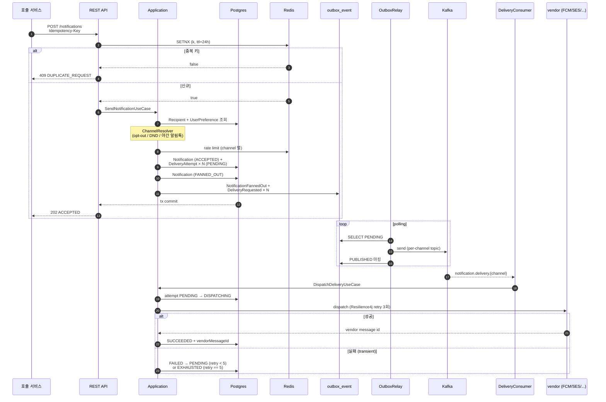
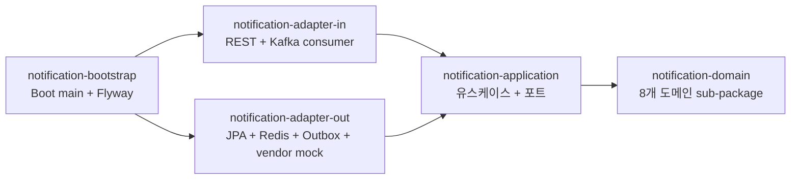

# Notification Hub

다채널 알림 발송 hub 입니다. 한 알림 요청을 사용자의 채널 선호도와 발송자 정책에 따라
push / email / SMS / 카카오 알림톡 등으로 fan-out 하고, retry / DLQ / rate limit / template /
방해금지 시간 (DND, Do Not Disturb) / opt-out / 전송 추적까지 묶음 처리합니다.

```
요청 1건 ──▶ 채널 N개 fan-out ──▶ 채널별 worker ──▶ vendor 호출
              (Outbox + Kafka)        (Resilience4j retry)   (FCM / SES / Twilio / Kakao)
```

## 기술 스택

- **Language**: Java 21 (virtual threads)
- **Framework**: Spring Boot 3.4
- **Database**: PostgreSQL 16, H2 (local/dev)
- **Cache / KV**: Redis (Lettuce)
- **Messaging**: Apache Kafka (channel 별 topic 분리, Outbox 패턴)
- **Resilience**: Resilience4j (vendor 호출 retry)
- **Template**: Mustache (단일 중괄호 placeholder)
- **Build / CI**: Gradle 8, GitHub Actions, Docker, Kubernetes
- **Test**: Testcontainers (Postgres + Kafka + Redis)

## 풀어야 할 핵심 문제

- **알림 중복 발송 방지** — 사용자가 결제 후 두 번 클릭하거나 cron 이 재시작되어도 같은
  알림은 1번만. `Idempotency-Key` 헤더 + Redis SETNX (`SET IF NOT EXISTS`, 키가 없을 때만
  set 하는 원자 연산) + TTL 24h. 같은 키 재요청은 HTTP 409.
- **DB 커밋 ↔ 이벤트 발행 원자성** — "발송 등록" 트랜잭션 commit 과 Kafka publish 가 따로
  처리되면 안 됨. Outbox 패턴 (이벤트를 일단 같은 트랜잭션 안에서 outbox 테이블에 INSERT
  하고 별도 워커가 그걸 읽어 Kafka 로 보내는 구조) 으로 해결.
- **채널별 처리량 격리** — SMS / 알림톡은 vendor 호출당 비용 / throughput 한도가 PUSH /
  EMAIL 과 매우 다름. 같은 Kafka topic 에 섞으면 head-of-line blocking. 채널별로 topic /
  consumer-group / DLQ 정책 분리.
- **vendor 일시 장애 흡수** — FCM 5xx, SES throttling, 알림톡 timeout. Resilience4j
  `@Retry` (3회) + 도메인 단의 exponential backoff (max 5회) = 최대 8회 재시도 기회.
  그래도 실패하면 EXHAUSTED → 운영자 수동 재처리.
- **사용자 폭주 알림 차단** — 잘못된 cron 한 번이 같은 사용자에게 만 건 발송하면 vendor 비용
  폭증 + 스팸 신고. recipient × channel 별 token bucket (Redis INCR + PEXPIRE 를 Lua 로
  원자 처리) — 한도 초과 시 HTTP 429 + Retry-After.
- **방해금지 시간 / opt-out** — 마케팅 알림 야간 발송은 앱 삭제 1순위 사유. 사용자 timezone
  기반 22:00~08:00 silent (보안 알림 SECURITY 만 우회). 카카오 알림톡 은 vendor 정책상
  야간 무조건 차단.
- **다국어 / 채널별 본문 분리** — `auth.otp.v1` 한 키가 ko-kr / en-us locale 별, 그리고
  PUSH (긴 본문 가능) / SMS (90B 한도) 별 다른 row. 우선 locale → 없으면 ko-kr fallback.
- **이력 페이지네이션** — 사용자 알림 누적이 많으므로 offset 페이지네이션은 deep page 가
  느림. 직전 페이지 마지막 row 의 id 를 cursor 로 받는 방식.

## 핵심 설계 결정

상세한 배경은 [docs/adr/](docs/adr/) 의 7건에 있습니다.

| ADR | 결정 |
|---|---|
| [0001](docs/adr/0001-hexagonal-architecture.md) | 헥사고날 + 6개 멀티모듈 |
| [0002](docs/adr/0002-channel-fanout-topics.md) | 다채널 fan-out 을 Kafka topic 분리로 |
| [0003](docs/adr/0003-template-engine-mustache.md) | 템플릿 엔진 Mustache (Thymeleaf / Freemarker 비교) |
| [0004](docs/adr/0004-idempotency-outbox-retry.md) | Idempotency-Key + Outbox + retry 의 3중 안전망 |
| [0005](docs/adr/0005-user-preference-priority.md) | 종류별 opt-out / DND / 채널 우선순위 |
| [0006](docs/adr/0006-rate-limit-token-bucket.md) | 채널별 차등 한도 token bucket |
| [0007](docs/adr/0007-vendor-adapter-port.md) | DeliveryGateway 공통 port 1개 + 채널별 adapter |

## 발송 흐름



## 모듈 구조



도메인 sub-package:

| Package | 책임 |
|---|---|
| `notification` | Notification (aggregate root), Kind, Status, fanned-out event |
| `delivery` | DeliveryAttempt 상태머신, retry/backoff, DeliveryRequested event |
| `channel` | Channel + ChannelType (PUSH/EMAIL/SMS/KAKAO_ALIMTALK) + 형식 검증 |
| `recipient` | Recipient, RecipientId |
| `preference` | UserPreference (종류별 opt-out / 우선 채널) + QuietHours |
| `template` | Template (key + locale + channel 별 본문) + TemplateKey |
| `device` | DeviceToken (push 채널 raw token + disable) |
| `shared` | DomainEvent, IdempotencyKey, Locale, RateLimitDecision |

## 7개 핵심 use case

| Use case | 입력 | 핵심 책임 |
|---|---|---|
| `SendNotificationUseCase` | recipientId, kind, title/body 또는 templateKey, payload, idempotencyKey | 멱등성 점유 → preference 적용 → 채널 결정 → rate limit → DeliveryAttempt 생성 → Outbox 적재 |
| `DispatchDeliveryUseCase` | deliveryAttemptId | PENDING → DISPATCHING → vendor 호출 → SUCCEEDED / 도메인 retry 누적 |
| `AcknowledgeDeliveryUseCase` | deliveryAttemptId, success, vendorMessageId | vendor webhook 수신, idempotent (이미 final 이면 무시) |
| `UpdateUserPreferenceUseCase` | recipientId, kind, allowed, preferredChannels, quietHours, timezone | 사용자 본인 선호도 변경 (mandatory kind 는 거절) |
| `RegisterTemplateUseCase` | key, locale, channelType, title/body template | 운영자 템플릿 등록 (key+locale+channelType unique) |
| `ListMyDeliveriesUseCase` | recipientId, cursor, limit | cursor 페이지네이션 (limit max 100) |
| `RegisterDeviceTokenUseCase` | recipientId, platform, token | push device token 등록 (같은 raw token 중복 차단) |

## 실행 방법

H2 + Mock vendor 로 외부 의존성 없이 실행할 수 있습니다.

```bash
./gradlew :notification-bootstrap:bootRun
```

prod 모드 (Postgres + Redis + Kafka) 는 docker-compose 로:

```bash
docker compose -f infrastructure/docker-compose.yml up -d postgres redis kafka kafka-ui
SPRING_PROFILES_ACTIVE=prod ./gradlew :notification-bootstrap:bootRun
```

### 발송 한 사이클 (curl)

```bash
# 1. recipient seed (실제론 외부 user/auth service 가 master)
# (본 저장소에서는 통합 테스트의 seed 코드 참조)

# 2. 알림 발송 — Idempotency-Key 필수
curl -s -X POST http://localhost:8080/api/v1/notifications \
  -H 'Content-Type: application/json' \
  -H "Idempotency-Key: $(uuidgen)" \
  -d '{
    "recipientId": "user-1",
    "kind": "SECURITY",
    "title": "OTP",
    "body": "코드: 654321"
  }' | jq

# 3. 같은 Idempotency-Key 재요청 → 409
curl -i -X POST http://localhost:8080/api/v1/notifications \
  -H 'Content-Type: application/json' \
  -H 'Idempotency-Key: dup-key-001' \
  -d '{ "recipientId":"user-1", "kind":"SECURITY", "title":"OTP", "body":"코드: 1" }'

# 4. 내 알림 이력
curl -s "http://localhost:8080/api/v1/notifications/me?recipientId=user-1&limit=10" | jq

# 5. 사용자 선호도 — 마케팅 opt-out
curl -s -X PUT http://localhost:8080/api/v1/users/user-1/preferences \
  -H 'Content-Type: application/json' \
  -d '{ "kind": "MARKETING", "allowed": false }' | jq

# 6. 운영자 템플릿 등록
curl -s -X POST http://localhost:8080/api/v1/templates \
  -H 'Content-Type: application/json' \
  -d '{
    "key": "auth.otp.v1",
    "locale": "ko-kr",
    "channelType": "SMS",
    "titleTemplate": "OTP",
    "bodyTemplate": "[Acme] OTP {code} ({validMin}분간 유효)"
  }' | jq
```

- API 문서: <http://localhost:8080/swagger>
- 메트릭: <http://localhost:8080/actuator/prometheus>
- Kafka UI: <http://localhost:8081>

## 테스트 / 빌드

```bash
./gradlew check                              # 전체
./gradlew :notification-domain:test          # 도메인 단위 (외부 의존 0)
./gradlew :notification-application:test     # use case 단위 (mock)
./gradlew :notification-adapter-out:test     # adapter 단위
./gradlew :notification-adapter-in:test      # MockMvc 슬라이스
./gradlew :notification-bootstrap:test       # Spring context 부팅
./gradlew :e2e-tests:test                    # Testcontainers (Postgres+Kafka+Redis)
./gradlew :notification-bootstrap:bootJar    # 배포용 jar
```

## 운영 프로필 (`prod`)

`SPRING_PROFILES_ACTIVE=prod` 일 때 활성화되는 항목:

- PostgreSQL, Redis, Kafka 실제 사용
- vendor mock 4종 (FCM/SES/Twilio/Kakao 알림톡) — 학습 단계라 SDK 직접 의존 X. 실제로는
  vendor SDK 만 갈아끼우면 동작
- Outbox Relay (DB outbox 테이블에서 메시지를 읽어 Kafka 로 보내는 워커) 활성화
- Resilience4j retry (vendor 호출 단계 3회 재시도)
- Rate limit (Redis 기반 token bucket) 활성화

## 향후 개선 사항

- vendor adapter 실 SDK 화 — 학습 단계의 Mock 4종을 실제 SDK 로 교체
- DLQ 운영 endpoint — 운영자 UI 에서 EXHAUSTED attempt 를 조회 / 재발송 / 강제 종료
- multi-device push — 한 사용자 여러 디바이스 모두 fan-out (현재 가장 최근 1개)
- DND 정책 확장 — 평일/주말 분리, 휴일 캘린더 연동
- A/B 테스트 — 같은 templateKey 의 여러 본문을 트래픽 분기로 발송 + 도착률 비교
- vendor reputation 추적 — 채널 × vendor 조합별 도착률 / 실패율 metric → 자동 라우팅
  fallback (FCM 실패율 높으면 SMS 로)
- 통합 vendor SDK 의존 격리를 위한 별도 `notification-adapter-out-vendor` 모듈 분리

---

## 저장소 / push

이 저장소는 GitHub `ssa1004/notification-hub` 으로 push 되어 있습니다. 새로 clone 후
직접 push 가 필요하면 다음:

```bash
gh repo create ssa1004/notification-hub --public --source . --push --remote origin
# 또는 이미 만들어진 repo 라면
git remote add origin git@github.com:ssa1004/notification-hub.git
git push -u origin main
```
